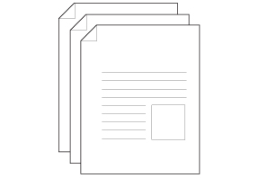
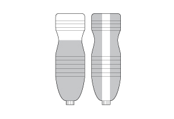
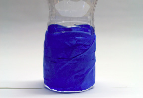
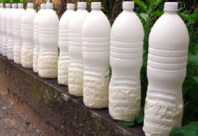

[&larr; Overview](index.md)

## 1. Bottle Covering

Tools/Materials needed for this step:
Tools: painter's masking tape, scissors
Materials: (5) 1.5 liter bottles, white paint, masking tape

1. Welcome to the Instructions for MAMA! The Windowfarms Version 3.0 Modular Airlift Multicolumn Array (MAMA). Please make sure you have registered on our.windowfarms.org, including having accepted the terms of service for participating in this open design community project. Registering will pass on to you a royalty-free license for you to use this community developed patent pending design for non-commercial purposes. Please use the Feedback button on the right to submit your ideas, questions, test results, and praise. ---------> Remember that this is an citizen technology project, so if you have an idea or an issue, research and develop it yourself (R&D-I-Y)! Propose a change to the community, get others to help you test how well it works, and then present your results. If it's a viable, universal solution to a common problem, it may be folded in to the next version release!

    

2. Getting Started: Download and print the Windowfarms v3.0 parts list. It contains a list of specific parts and recommended sources. Alternatively, by buying a kit, you can get in on wholesale batches of specialized parts while supporting both the Windowfarms Project and the disabled workers who assemble kits.

    

3. Section 1: Bottle Covering Each Windowfarm v3.0 column is made of 5 bottles: 4 plant bottles and 1 bottom reservoir bottle. Plant bottles and reservoir bottles are made slightly differently. This how-to addresses how to make the bottles for one column. Windowfarm instructions work best with 1.5 liter bottles made by Nestle waters, which produces Arrowhead, Calistoga, Deer Park, Ice Mountain, Ozarka, Poland Spring, and Zephyrhills brands in the United States. The waist of these bottles uniquely accomodates the hydroponic net cup. Extensive modification of the design will be needed if you get a different kind of bottle and root health and system evaporation rates can't be guaranteed. Use recycled bottles, not new ones!!

    

4. Part of each bottle must be covered to prevent the plants' roots from being exposed to light. The roots will not be able to act as roots if they are exposed to light. You also need to protect the nutrients in the bottom reservoir bottle from U/V light damage. Dark parts of the system are also less likely to grow algae. You can cover the bottles with tape or find some creative way of making them opaque (knitting cozies?). Here, we're demonstrating the popular spray paint covering method.

    

5. Fill an empty bottle with about 2"(5 cm) of water to weigh it down. Remove label with scissors without scratching the bottle. Remove as much glue/paper residue as is possible.

    

6. Using painter's masking tape, mask 4 of the bottles from the "waist" to the base.

    

7. Using 1" (2.5 cm) wide masking tape, mask the 5th bottle with one ribbon from the cap to the base.

    

8. Paint bottles with spray paint, providing even coverage. It will take 2-3 coats to create a layer of paint that will not let sunlight penetrate. Once dry, remove the masking tape from all bottles.

    
