[&larr; Overview](index.md)

## 10. Maintaining

### Tools

* measuring tape
* scissors
* snips

### Materials

* Plant Nutrient Solution or Powder
* Bead Chain
* Bead Chain Coupler
* Cotton String

***

1. Adding Water Fill the reservoir bottle with enough water to reach just below the hole. Water will evaporate from your system and will need replacement. Expect to top-off the system 2-3 times per week. However, conditions will vary effecting the rate at which more water is needed. Winter seasons and dry environments will require more frequent watering.

    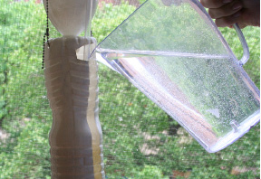

2. Adjusting the pump Use the dial on the air pump to adjust the flow rate of the water through your system. The flow should be just enough to create a steady drip of water through the system. A flow that is too high will create unnecessary power consumption and noise. A flow that is too little will create wilted plants. However, some plants like wetter conditions than others.

    

3. Adding Nutrients

    1. Phase 1 - First ten days after plants develop roots) 1 teaspoon per gallon 3-20-20 (+ pinch=0.1 teaspoon epsom)= 1/2 teaspoon per bottle twice a week for 6 weeks= 4.75 teaspoons;

    2. Phase 2 - Seedling through vegetative phase) .396 teaspoon Maxsea 16-16-16 twice a week (+ pinch=0.1 teaspoon epsom) for 6 weeks= 4.75 Maxsea 16-16-16; 

    3. Phase 3 - Transition, last 2 weeks before flowering) 0.198 each of both kinds of Maxsea twice a week (+ pinch=0.1 teaspoon epsom) for approximately 2 weeks= 3/4 teaspoons of each Maxsea; Phase 4- Flowering and fruiting) 2 teaspoons per gallon of 3-20-20 (+ pinch=0.1 teaspoon epsom) = 3/4 twice per week for 4 weeks= 6.25 teaspoons Phase 5- Last 10-15 days before harvest) Feed your plants only water to flush the system

  

4. Setting the timers At first, set the timer on a 15 minute interval as pictured. Adjust as you observe plant response. Consult the web community for recommendations on pump and lighting (optional) schedules for the different life stages of your plants. Consult the timer's package for directions on setting the timer.

    

5. Pollination Using a small paint brush, mimic a bee's action and dust the pollen from one flower to the other, addressing each flower on the plant.

    

6. Flushing the system Place a bucket beneath the column to catch the draining water. Unscrew the bottom cap to flush the system. Start by flushing twice per week and adjust the frequency based on your plants' response. Consult the web community to troubleshoot issues with your plants.

    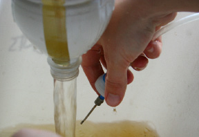

7. Trellising plants As plants grow taller, use plant tape or fishing wire secured to the suspension system to create an adjustable support structure.

    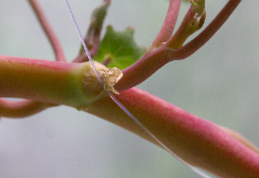

8. Cleaning tubes and bottles The tubes and the reservoir bottle will slowly accumulate algae growth on the inner walls. While not harmful to the plants, the algae reduces water flow efficiency.

    

9. Start by measuring and cutting one 30" (76 cm) piece of bead chain.

    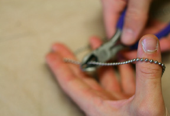

10. Measure and cut an 18" (46 cm) piece of cotton cord. Loop the cord back and forth in 3" (7.6 cm) lengths in your hand.

    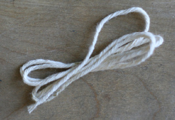

11. Measure and cut one 4" (10 cm) piece of cotton cord. Tie it with a double knot around the center of the 3" (7.6 cm) looped cotton cord bundle.

    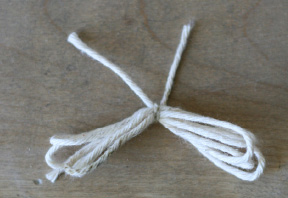

12. Thread one end of the 4" (10 cm) cotton cord piece through the center hole of a bead chain end coupler. You have created a small mop head. Snap the mop head assembly to one end of the 30" (76 cm) bead chain.

    

13. You now have a cleaning device for your water tubes. If the walls of the water tube accumulates algae, remove the tubes from the system and pull them apart at the connection joints. Use this tool to clean the tubes by feeding the beaded end of the chain down the tube, and pull-through. The mop head will drag algae with it. Rinse the mop head with water after each pull and repeat as many times as is needed.

    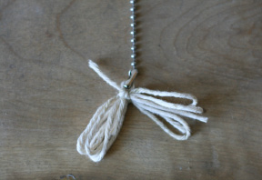

14. Measuring and Adjusting the pH levels Gather a pH test strip and the reference card.

    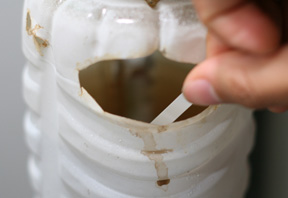

15. Dip the testing end of the pH strip into the bottom bottle, fully immersing it in the solution for a few of seconds.

    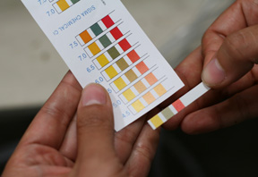

16. Remove the strip from the water and wait 10 seconds. Compare the color of the strip to the closest match on the reference card. The pH of properly balanced water is between 7.0 and 7.5. You want your nutrient solution to be in this range so that the plants' roots can most effectively absorb the nutrients. The most common time you will need to rebalance your solution's pH levels are after adding fresh nutrients and/or changing the entire bottom bottle's water solution. Once you identify a pattern of how to balance your pH given your nutrient type, stick to it for best practice. In order to raise the pH level, you need to make your solution more basic. The simplist way to do this is to add a pinch of baking soda. In order to lower the pH level, you need to make your solution more acidic. The simplist way to do this is to add a few drops of distilled vinegar.

    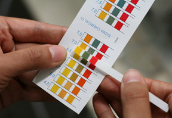

17. Apply your baking soda or vinegar as needed, and retest the solution's pH once everything has dissolved.

    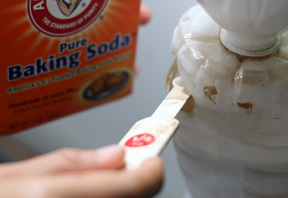
